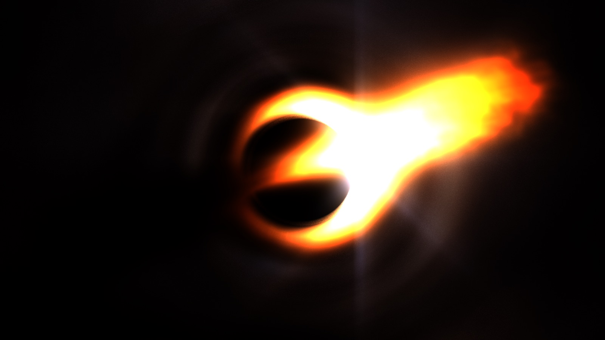
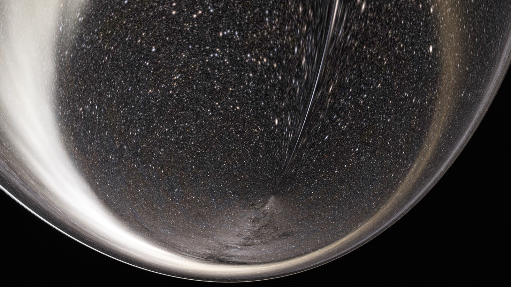
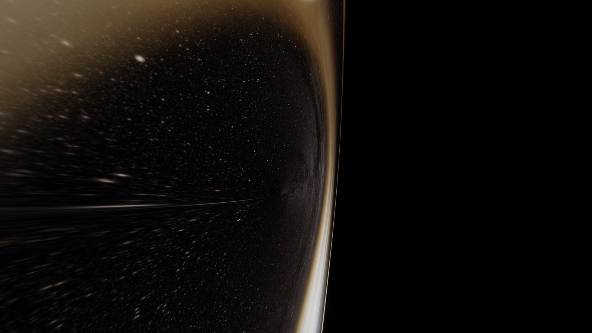

# SpaceTime.jl

**A general-relativistic ray tracer and virtual camera, written in Julia.**
Point a camera at a black hole — from a safe distance, from inside the photon
sphere, or falling through the horizon — and photograph what is actually there.



SpaceTime.jl is two things at once:

- **An educational resource.** Every image is the numerical solution of the
  null geodesic equation in a Schwarzschild or Kerr spacetime — no fakery, no
  precomputed distortion maps. The code is written to be read alongside a GR
  textbook (Hartle's *Gravity* pairs well), and the test suite doubles as a
  set of executable physics statements: tetrad orthonormality, exact
  relativistic Doppler factors, the 3√3 M shadow.
- **A rendering library.** A GPU ray tracer on Apple silicon (Metal) and a
  platform-independent CPU reference, a physical camera/lens/sensor pipeline,
  a fluid simulation on the disc, and production-quality offline rendering
  with linear HDR masters for grading. Shots are composed in the companion
  real-time app, [SpaceTimeMetal](https://github.com/dan-sprague/SpaceTimeMetal)
  (Rust + Metal), and rendered here.

## Gallery

| | |
|---|---|
|  |  |

*Left: the view from r = 2.5M, inside the photon sphere — the entire outside
universe compressed into a 137° "escape cone", wrapped by the lensed image of
the accretion disc. Right: the same cone edge rolled vertical, surfing along
constant radius.*

## The physics you can see

- **Gravitational lensing** — Einstein rings, secondary and higher-order disc
  images wrapping the shadow, photon rings at the r = 3M light sphere.
- **The escape cone** — inside the photon sphere only rays within
  sin ψ = √27·M·√(1−2M/r)/r escape; the sky becomes a shrinking marble.
- **Doppler-shaded disc** — Keplerian gas shaded by Planck emission at its
  Doppler- and gravitationally-shifted temperature: the approaching side beams
  hot and blue, the receding side dims red.
- **Horizon-crossing camera** — the GPU renderer works in horizon-regular
  Kerr–Schild coordinates; below r = 2.5M the camera becomes a radial
  free-faller (static observers don't exist there), and the view stays smooth
  across r = 2M.
- **Observer-frame special relativity** — give the camera a velocity and its
  tetrad is Lorentz-boosted: aberration crowds the sky forward, the forward
  view blueshifts and beams (g⁴), the rear view dims toward black. Every
  black-hole video you've seen is falling; this one is flying.
- **A camera with mass** — the camera can ride a timelike worldline
  (`ShipState`, `Track`) integrated with the same geodesic equations as the
  light: engines off is exact free fall (orbits, plunges, accelerometer at
  zero), thrust is proper acceleration in the ship's own frame, and the
  ship's velocity feeds the boosted tetrad, so aberration and Doppler build
  as you burn.
- **Time dilation telemetry** — video renders can burn in a HUD comparing the
  ship's proper time (dτ = dt·√(1−2M/r)/γ) against coordinate time at
  infinity.

## Requirements

- Julia ≥ 1.10.
- **Apple silicon** for the fast path (the GPU renderer is Metal). The CPU
  renderer (DifferentialEquations.jl, Tsit5 on the geodesic Hamiltonian) is
  platform-independent and serves as the high-fidelity reference
  implementation.

## Quick start

```julia
using SpaceTime, StaticArrays, FileIO

bh  = Schwarzschild(1.0)
cam = Camera(SVector(0.0, -30.0, 3.0), SVector(0.0, 0.0, 0.0), SVector(0.0, 0.0, 1.0), Lens(24.0))
sky = load("assets/starmap_g4k.jpg")     # or any equirectangular image
disc = AccretionDisc(inner_radius = 3.0, outer_radius = 20.0)

img = render(cam, bh, sky; disc = disc, width = 640, height = 360)
save("hole.png", rotr90(img))    # images are [width, height]; rotate for display
```

(Loading a JPEG needs an image codec such as `ImageIO` or `Images` in the
environment, which the `examples` environment below provides.)

The example and video scripts live in `examples/` with their own environment
(the package itself only depends on what rendering needs):

```bash
git clone https://github.com/dan-sprague/SpaceTime.jl
cd SpaceTime.jl
julia --project=examples -e 'using Pkg; Pkg.develop(path="."); Pkg.instantiate()'

# The 4K "hero shot" on the CPU (HERO_LOWRES=1 for a fast draft) and on the GPU
julia -t auto --project=examples examples/hero_shot.jl
julia -t auto --project=examples examples/hero_shot_gpu.jl
```

## Rendering videos

`examples/videos/` holds reproducible scripts for the produced shots — the
porthole escape (with optional observer-frame relativity and telemetry HUD),
a thin-lens "documentary" orbit, and a seamless website loop. They share
conventions:

- `RES=proxy|final` (some also `4k`) — always iterate at proxy first.
- `SAVE_TIFF=1` writes every frame's raw linear render as a losslessly
  compressed Float32 TIFF into `renders/<shot>/<res>/linear/` — clean HDR
  masters for grading in Resolve/Nuke, untouched by the built-in film look.
- Long renders are resumable: `STOP_AFTER=9` exits cleanly after ~9 h and the
  next identical launch continues where it stopped, bit-identical.
- Everything a render produces lands under `renders/` (gitignored).

```bash
RES=proxy julia -t auto --project=examples examples/videos/render_escape.jl
REL=1 RES=final julia -t auto --project=examples examples/videos/render_escape.jl
RES=4k SAVE_TIFF=0 STOP_AFTER=9 julia -t auto --project=examples examples/videos/render_documentary.jl
```

## How it works

**Geodesics.** Photons follow null geodesics of the Schwarzschild metric,
integrated in Cartesian Kerr–Schild coordinates on both paths — regular at
the poles and the horizon (that's what makes interior cameras possible). The
CPU path integrates Hamilton's equations adaptively with
DifferentialEquations.jl; the GPU kernel defaults to fixed-step RK4 with a
radius-adaptive step, with adaptive Tsitouras 5(4) selectable per render
(`order=45` capped at the radius-adaptive step, `order=46` uncapped with an
error tolerance `tol`; the volumetric gas is marched on its own arc-length
stride, so gas quality is independent of the integrator's step schedule).
Rays are traced *backward* from the camera to the sky,
the disc, or the shadow.

**Cameras are tetrads.** A camera is an orthonormal frame: a static observer
where one exists, a radial free-faller inside r = 2.5M, and optionally
Lorentz-boosted by a 3-velocity (`beta`) for a powered ship. Each ray is
normalized to unit frequency in the camera frame, so the conserved p_t yields
the full gravitational + motion shift per pixel; disc temperatures and sky
colors follow from one factor.

**The disc.** A volumetric density grid (log-r × φ × z) with procedural
structure, marched along each geodesic with alpha compositing; emission is a
white-balanced Planck lookup at the locally-shifted temperature. A Stam-style
stable-fluids simulation (`DiscFluidSim`) can advect the density live on the
Keplerian shear flow.

**The camera pipeline.** Pinhole, thin-lens (stratified concentric aperture
sampling, PBRT-style), and equidistant fisheye projections; Airy/bloom PSF via
FFT convolution; ACES tonemapping with a hue-preservation dial; a sensor model
(ISO gain, shot/read noise, full-well clipping); practical effects (vignette,
lens distortion, dust, micro-streaks).

## Repository map

```
src/
  gr.jl              metric, geodesic Hamiltonian
  raytrace.jl        CPU renderer (DiffEq, static-observer tetrad)
  metal.jl           GPU renderer (Metal kernel, Kerr–Schild, DoF, reprojection)
  preview.jl         camera tetrads, Kerr–Schild photon init, fixed-step CPU preview
  ship.jl, track.jl  timelike worldlines: a camera with mass, racing-line tracks
  disc_volume.jl     volumetric accretion disc
  disc_sim.jl        live fluid simulation on the disc grid
  blackbody.jl       Planck emission, white balance
  camera.jl          camera types, projections, lens sampling
  postprocess.jl     bloom/streaks/tonemap grading
  sensor.jl          sensor exposure and noise model
  ...
ext/                 Makie extension: ray animations, Hamiltonian-drift plots
examples/            still-image demos and the video render scripts (own env)
assets/              the deep-sky starmap (NASA/Goddard SVS)
test/                unit tests + executable physics checks
docs/assets/         README images
renders/             (gitignored) everything renders write
```

## Verification

`test/runtests.jl` includes physics checks, not just plumbing: the boosted
camera tetrad is orthonormal under the Kerr–Schild metric to 1e-12 at radii
down to 2.6M and speeds up to 0.9c; the per-ray frequency shift reproduces
the exact relativistic Doppler factor γ(1+β); the far-field shadow matches
the critical impact parameter 3√3 M. The CPU and GPU renderers are kept as
mutual references — same scene, two independent formulations.

## How this was built, and why it's free

<!-- TODO(dan): write this section. Notes:
- Built with AI (Anthropic's Claude); state it plainly, up front.
- Nobody yet knows what the scientific community's norms for AI-assisted
  work should be — the tools arrived before the culture.
- This repo's answer is a standard that doesn't ask for trust: every physics
  claim is executable (tetrad orthonormality vs the metric at machine
  precision, exact Doppler γ(1+β), shadow pinned to 3√3 M; independent CPU
  and GPU implementations must agree).
- Hope: this package as an example of the good that can come from these
  tools.
- The pledge: MIT forever; no CLA ever (contributors keep copyright — the
  structural guarantee against relicensing); no future version under a more
  restrictive license; any commercial work built on this package, never
  instead of it; nothing scientific ever paywalled.
- Free, for everyone, forever.
-->

## Credits

- Star map: NASA/Goddard Space Flight Center Scientific Visualization Studio
  deep star maps.
- Built with DifferentialEquations.jl, Metal.jl, and the JuliaImages
  ecosystem.

## Roadmap

- Shot files: pose a camera in SpaceTimeMetal, save it as JSON, render it here
- Flux-conserving star catalog rendering (point sources with real magnitudes)
- Documenter.jl docs working through the physics chapter by chapter
- Registration in General
